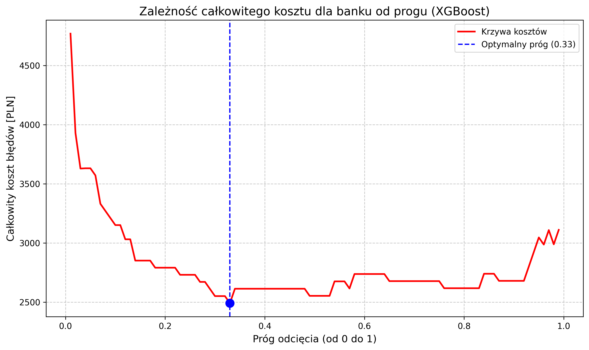
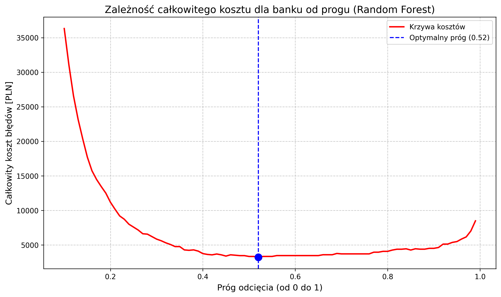
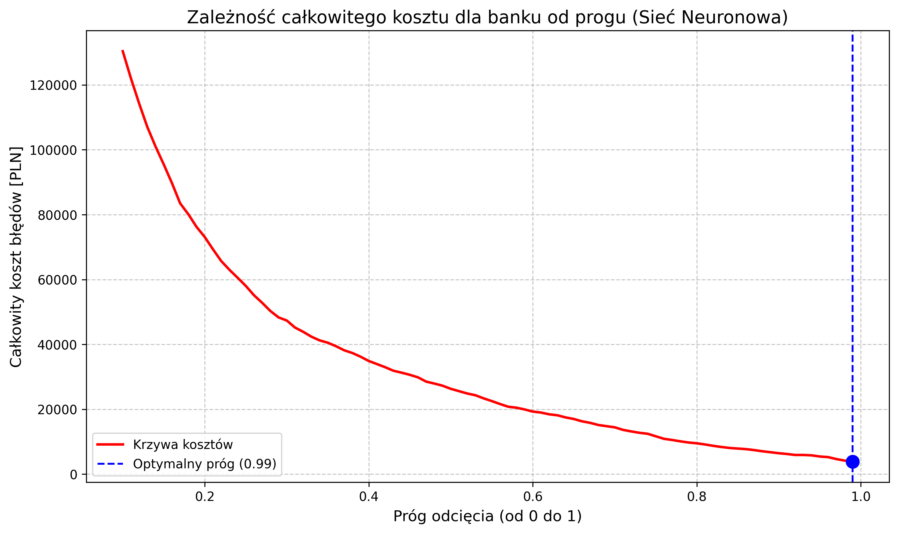
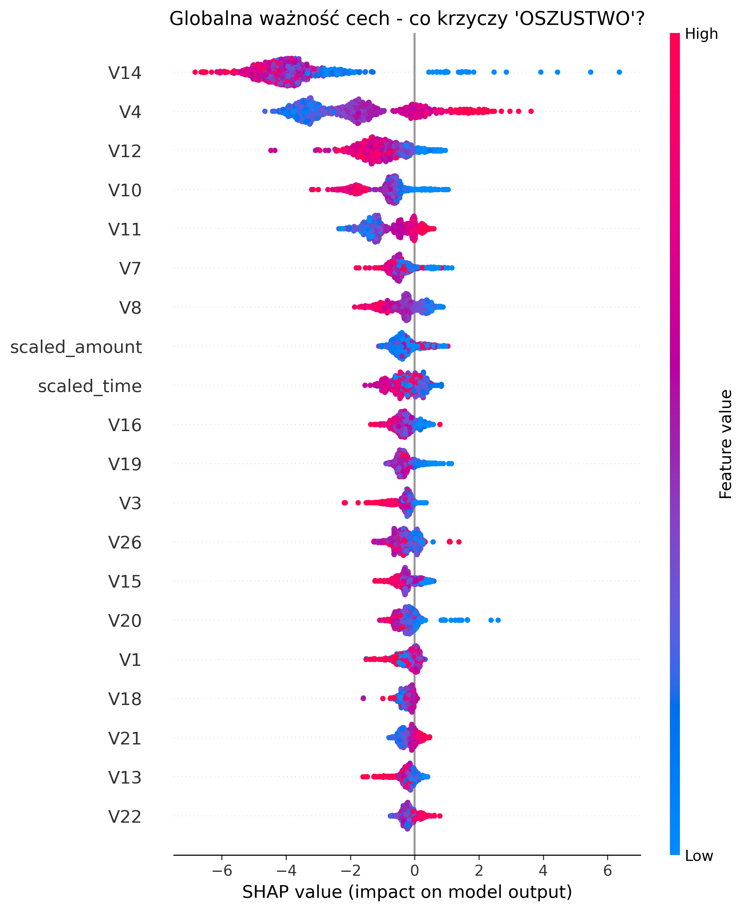
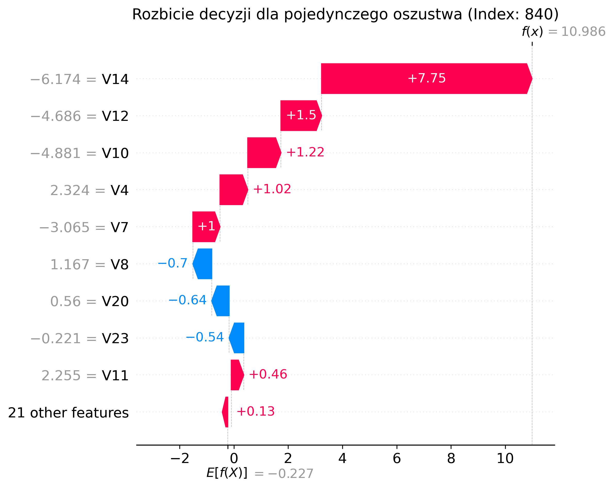

# Fraud Detection: Business-Cost Optimized Machine Learning 🕵️‍♂️💳

An end-to-end Machine Learning project focused on detecting fraudulent credit card transactions. Unlike traditional models optimized purely for standard classification metrics (like Accuracy or ROC-AUC), this project is explicitly built to **minimize real-world financial losses** by finding the optimal decision threshold based on a custom Business Cost Matrix.

## 🎯 Business Objective & Cost Matrix

In fraud detection, not all errors are equal. Traditional metrics treat False Positives (FP) and False Negatives (FN) similarly, which does not reflect the reality of the banking sector.

For this project, the business environment assumes:
* **Cost of False Positive (FP):** `60.00 PLN` (Cost of blocking a legitimate customer's card, customer service intervention, and potential churn).
* **Cost of False Negative (FN):** `122.21 PLN` (Average financial loss when a fraudulent transaction is approved).

The core objective is to scan through classification thresholds (from 0.01 to 0.99) and select the one that yields the **lowest total cost** for the bank.

## 🗄️ Data & Preprocessing Pipeline

The data pipeline ensures robust handling of highly imbalanced data and outliers:
* **Data Source:** Extracted directly from a local PostgreSQL database (`data_loader.py`).
* **Scaling:** Applied `RobustScaler` to `Amount` and `Time` features to handle extreme outliers without distorting the data distribution (`preprocessing.py`).
* **Splitting:** Stratified train-test split to maintain the exact ratio of legitimate to fraudulent transactions in both sets.

## 🧠 Modeling & Cost Optimization

Three different algorithms were trained and fine-tuned using `GridSearchCV` (with balanced class weights to combat the data imbalance). For each model, a cost-curve analysis was performed to find the optimal decision threshold.

### 1. XGBoost (`train_xgb.py`)
Achieved the best overall performance and the lowest business cost.

*Blue dashed line indicates the optimal threshold that minimizes the total financial loss.*

### 2. Random Forest (`train_rf.py`)
A strong ensemble baseline model.


### 3. Deep Neural Network (`train_nn.py`)
Built using TensorFlow/Keras, featuring `BatchNormalization`, `Dropout` layers, and early stopping to prevent overfitting.


## 🔍 Explainable AI (SHAP)

To ensure the model is not just a "black box," SHAP (SHapley Additive exPlanations) values were used to interpret the XGBoost model's decisions for both technical and business stakeholders.

### Global Feature Importance
What generally drives the fraud prediction?


### Local Decision Breakdown
Why was *this specific* transaction flagged as fraud?


## 🛠️ Tech Stack

* **Language:** Python 3.x
* **Data Processing:** Pandas, NumPy, Scikit-Learn
* **Machine Learning:** XGBoost, TensorFlow / Keras
* **Explainability:** SHAP
* **Database:** PostgreSQL, SQLAlchemy
* **Visualization:** Matplotlib

## 📂 Project Structure

```text
├── src/
│   ├── data_loader.py      # PostgreSQL connection and data extraction
│   ├── preprocessing.py    # RobustScaling and stratified splitting
│   ├── utils.py            # Business cost calculation and plotting functions
│   └── logger.py           # Custom logging configuration
├── models/
│   ├── train_xgb.py        # XGBoost training, tuning, and SHAP analysis
│   ├── train_rf.py         # Random Forest training and tuning
│   ├── train.nn.py         # Neural Network training (Keras)
│   └── xgboost/
│       └── best_xgb_model.pkl # Saved final model
├── README.md               # Project documentation
└── requirements.txt        # Python dependencies
```

## 🚀 How to Run

1. Clone the repository.
2. Install the required packages:
   ```bash
   pip install -r requirements.txt
   ```
3. Ensure your PostgreSQL database is running and update the connection string in `src/preprocessing.py` if necessary.
4. Run the training scripts to reproduce the results and generate plots:
   ```bash
   python models/train_xgb.py
   ```